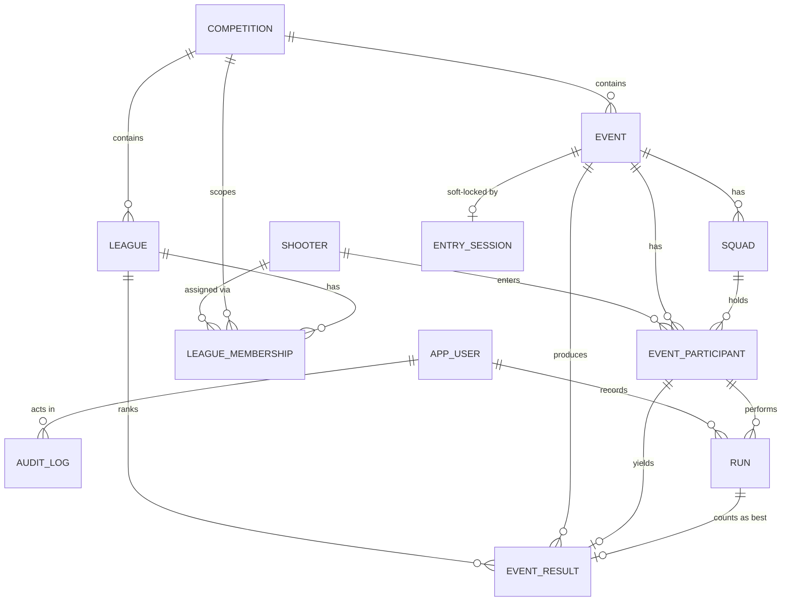
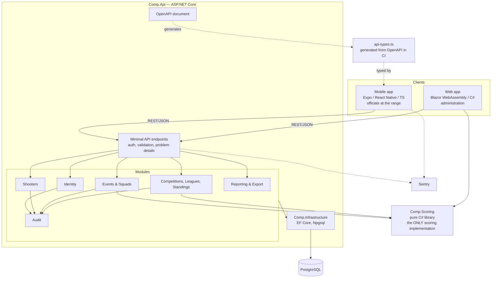
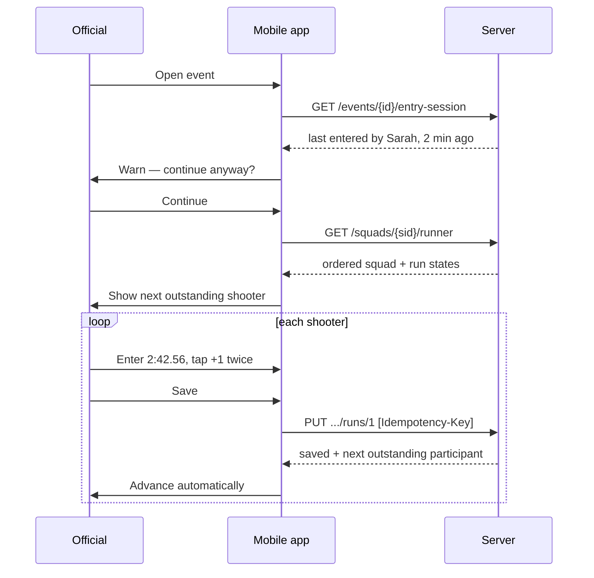

# Shooting Competition Management System
## Discovery & Architecture Brief — Version 3

**Date:** 14 September 2026
**Target first live season:** January 2027
**Changes from v2:** mobile client moves from .NET MAUI to Expo (React Native). Contract
generation, store release pipeline, testing and roadmap revised accordingly. Domain model and
scoring rules unchanged.

---

## 0. Settled decisions

| Ref | Decision |
|-----|----------|
| D1 | Penalties applied **per run**: `adjusted = raw + (count × penaltySeconds)`. Fastest adjusted run across the shooter's valid runs becomes the event time. |
| D2 | Times stored as integer milliseconds, entered and displayed as **`m:ss.cc`**. |
| D3 | Ties broken on the shooter's **other** run; fastest wins. Still tied, position shared, both take the higher points. |
| D4 | No points floor. Leagues cap at 20 shooters, so 50-down-by-1 never reaches zero. |
| D5 | A missed event scores **0 and is droppable**. The drop rule doubles as an attendance allowance. |
| D6 | **Competition** is the annual top level, holding ~5 leagues. Every event belongs to one competition and scores for all its leagues. |
| D7 | Drop rule applies **continuously**. With `dropWorstCount = 5`, standings begin counting after event 6 and always exclude the worst five to date. |
| D8 | Backend and web admin in **C#/.NET**. |
| D9 | **Both** iOS and Android. |
| D10 | Mobile client in **Expo (React Native)**. |

### Assumptions

- Before event `dropWorstCount + 1`, league tables show the running total marked provisional.
- Every event counts towards standings by default, with a per-event flag to exclude a fun shoot.
- One competition per year initially, but the model does not assume it.

---

## A. Product Definition

### What it does

A system of record for a weekly timed shooting competition. It holds the shooter register, runs
each event from participant selection to a published and locked result, and maintains the league
tables of the annual competition those events belong to.

### Structure

```
Competition (annual)
├── League "Division A"   tier 1   ≤20 shooters
├── League "Division B"   tier 2
├── League "Division C"   tier 3
├── League "Division D"   tier 4
├── League "Division E"   tier 5
└── Events (~52)
        └── every event includes shooters from every league,
            producing one overall table plus one table per league
```

At year end the competition closes, standings freeze, and an admin promotes and relegates
shooters into the following year's competition.

### Who uses it

| User | Where | What they do |
|------|-------|--------------|
| Super Administrator | Web | User accounts, competitions, leagues, promotion and relegation |
| Competition Administrator | Web + mobile | Creates events, selects participants, finalises and publishes, amends published results if granted the privilege |
| Event Official | Mobile | Builds squads, records times, penalties and DNFs |
| Read-only | Web | Views and exports results and standings |

Shooters have no login. They are records, not accounts.

### Core workflows

1. **Register upkeep.** Shooters exist before any event; officials can add one mid-event.
2. **Event setup.** Recent-first type-ahead participant search, add straight into a squad, queue
   further squads ahead.
3. **Live entry.** Work down squad 1 recording run 1, loop back for run 2, move to squad 2.
   Out-of-order and ad-hoc entry throughout.
4. **Finalise.** Review, finalise, publish, lock.
5. **Standings.** Every league in the competition recalculates automatically, including after an
   amendment.

### Core business rules

```
adjusted_run_time = raw_time_ms + (penalty_count × event.penalty_seconds × 1000)
event_time        = min(adjusted) across the shooter's valid runs
```

- A DNF run has no time and cannot be the counting run.
- One DNF plus one valid run: the valid run stands.
- Both DNF: listed in the results table, unranked, 0 league points.
- Only one run completed: ranked on that run.
- League points are position **within the league**, not overall: 50, 49, 48 …
- Standings = sum of event points less the worst `dropWorstCount` results to date, absences as 0.
- Competitions reset annually. Shooters do not change league mid-competition.

---

## B. Functional Requirements

### MVP — live for January 2027

**Identity.** Email and password login, four roles, persistent mobile sessions, a separate
`AmendPublishedResults` privilege.

**Shooters.** Create, edit, deactivate, search. First name, last name, nickname, optional
membership number. League assignment per competition. Full history.

**Competitions and leagues.** Create a competition and its leagues with points and drop rules,
assign shooters, run end-of-year promotion and relegation.

**Events.** Create with number, name, date, competition, penalty seconds, counts-for-standings
flag. Participant selection with recent-first type-ahead, inline add-to-squad, inline shooter
creation. Squad management including moving a shooter mid-event. Lifecycle with locking.

**Result entry (mobile).** Squad runner showing run 1 and run 2 state per shooter. `m:ss.cc`
keypad. Penalty counter supporting up to 20. DNF toggle. Save advances automatically. Jump to any
shooter. Concurrent-entry detection with warning. Every entry stamped with the recording user.

**Results and standings.** Overall and per-league tables live during the event. Finalise and
publish. Amendment behind a privilege with a mandatory reason. Full audit trail. Standings showing
running total, counting total and dropped results.

**Output.** Print-friendly HTML for results and standings giving a clean PDF through the browser.
CSV export.

### Phase 2

Offline-first mobile with a sync queue. Generated PDFs with club branding. Shooter self-service.
Results-published email. Season summary reporting.

### Future

Multiple clubs, alternative scoring formats, online entry and fees, membership management, timing
hardware integration, public leaderboards, API access.

---

## C. Non-Functional Requirements

| Area | Requirement |
|------|-------------|
| Performance | Run save acknowledged under 500ms on 4G. 120-shooter results table under 1s. Standings across 52 events under 2s. |
| Availability | Best-effort, but solid for a 3-hour window on event night. Single API instance with a restart policy is acceptable. |
| Reliability | No acknowledged result is ever lost. Idempotency keys prevent duplicate submission. |
| Auditability | Every create, update and delete on a run or result records actor, timestamp, before and after. Amendments also record a reason. |
| Security | HTTPS only. ASP.NET Core Identity password hashing. Server-side authorisation on every endpoint. Rate limiting on auth. |
| Data protection | Name, optional nickname, optional membership number. Nothing else. |
| Maintainability | Scoring exists in exactly one implementation, server-side, in a library with no EF Core or UI dependency. The mobile client never calculates a result. |
| Scalability | ~6,000 results a year. Trivial for Postgres. Multi-club must remain possible. |
| Offline | Out of scope for MVP. All server calls sit behind one client interface so a queue can be inserted later without touching the UI. |

---

## D. Domain Model



### Entities

**Shooter** — the permanent identity on a surrogate GUID, so renaming or correcting details never
touches historical results. Never hard-deleted, only deactivated.

**Competition** — the annual container and top level. Owns leagues, events and memberships.
Closing it freezes standings and enables promotion. No separate `Season` entity; the competition
is annual and carries the year. A second competition in the same year is representable without
schema change.

**League** — one division within one competition, e.g. "Division A 2027". Carries its own scoring
configuration. `Tier` orders the divisions and drives promotion and relegation.

**LeagueMembership** — one shooter, one league, one competition. A unique constraint on
`(CompetitionId, ShooterId)` enforces the no-mid-year-moves rule in the database.

**Event** — one weekly night. Belongs to one competition, scores for every league in it. Holds
that night's penalty seconds, the counts-for-standings flag, and the scoring rules version used.

**Squad** — an ordered group created on the day. Membership lives on the participant record so a
shooter can be moved mid-event.

**EventParticipant** — a shooter's entry, snapshotting the league they were in at that moment, so
correcting a membership error in March cannot rewrite January's division tables.

**Run** — the raw fact: run number, raw milliseconds (null when DNF), penalty count, DNF flag,
recorder, timestamps, idempotency key.

**EventResult** — computed per participant: best run, event time, overall position, league
position, league points, rules version. Derived live, frozen at finalisation.

**AuditLog** — append-only. Entity, action, actor, timestamp, before and after JSON, reason.

**EntrySession** — one row per event supporting detect-and-warn.

### Design positions

| Question | Position |
|----------|----------|
| Stored or derived? | Runs are facts, stored. Event results derived live, **frozen at finalisation**. League standings always derived from stored event points, so amendment triggers recalculation for free. |
| Delete policy | Soft throughout. Runs never deleted; corrections update the row and write audit. |
| Changing shooter details | Only the shooter row changes; everything references the GUID. |
| Locking | `Finalised` blocks writes at the service layer with a database constraint as backstop. Unlocking needs the amend privilege and writes audit. |
| Rule changes | `ScoringRulesVersion` per event. Old versions stay callable. Recalculation is explicit and audited. |
| Multi-club later | Nullable `OrganisationId` on `Competition`. Never assume in code that only one exists. |

---

## E. Architecture

**Modular monolith.** One ASP.NET Core service, one database, module boundaries enforced by
project references.



Three rules hold this together.

**`Comp.Scoring` references nothing.** No EF Core, no ASP.NET, no database types. Plain records
in, plain records out. Exhaustively testable, and a rule change lives in one project.

**The mobile client never scores.** It displays what the server returns. Porting the rules to
TypeScript for a live provisional table would create a second implementation that will eventually
disagree with the first, and the disagreement would surface as a wrong league table. The phone is
online by design, so the round trip costs nothing worth having.

**The API's OpenAPI document generates the mobile client's types.** Generation runs in CI and a
drift fails the build, so the two languages cannot quietly diverge on a field name or a nullable.

### Repository layout

```
repo/
├── Comp.sln
├── src/
│   ├── Comp.Domain              entities, value objects, enums
│   ├── Comp.Scoring             pure rules engine — no dependencies
│   ├── Comp.Application         use cases, validation, authorisation policies
│   ├── Comp.Infrastructure      EF Core, Npgsql, Identity, audit interceptor
│   ├── Comp.Api                 ASP.NET Core minimal API host
│   ├── Comp.Contracts           DTOs — source of the OpenAPI document
│   └── Comp.Web                 Blazor WebAssembly admin app
├── clients/
│   └── mobile/                  Expo app (TypeScript)
│       ├── app/                 Expo Router screens
│       ├── api/                 generated types + typed client + IApiClient seam
│       └── features/entry/      squad runner, keypad, penalty counter
├── tools/
│   └── generate-api-types/      OpenAPI → TypeScript, run in CI
└── tests/
    ├── Comp.Scoring.Tests       unit, property-based, golden fixtures
    ├── Comp.Api.Tests           WebApplicationFactory + Testcontainers
    ├── Comp.Web.Tests           bUnit
    └── mobile/                  Vitest unit, Maestro E2E flows
```

One repository, so an API change and its client update land in the same commit. No background job
host, message queue, object storage or notification service in MVP.

---

## F. Technology Stack

### Backend and web

| Layer | Choice | Reasoning |
|-------|--------|-----------|
| Runtime | **.NET 10 (LTS)** | Supported into late 2028, past the first two seasons. Do not start on an STS release. |
| API | **ASP.NET Core Minimal APIs** | Less ceremony than controllers at this size, same pipeline and authorisation. |
| ORM | **EF Core 10 + Npgsql** | Migrations, change tracking for the audit interceptor, `FromSql` for the standings query where set-based SQL reads better. |
| Database | **PostgreSQL 16** | Correct for relational, ranked, referentially strict data, and cheap to host. |
| Validation | **FluentValidation** | Composable, testable, wired as an endpoint filter. |
| Auth | **ASP.NET Core Identity + JWT bearer** | Hashing, lockout, TOTP MFA and token providers already built. Access tokens 15 minutes, rotating refresh tokens 90 days so officials stay signed in. |
| Web | **Blazor WebAssembly (standalone)** | Admin-only behind login, so no SEO or SSR argument. Static bundle hosts free, shares DTOs and the scoring library with the server. Blazor Server rejected: a live SignalR circuit is the wrong dependency on patchy data. |
| Logging | Serilog, structured, to stdout | |
| Errors | Sentry .NET + Blazor SDKs | |

**One flip condition on the web app.** Blazor WASM is the right choice if you are comfortable in
Razor. If you are not, put the admin app in React instead: you would then be learning one
ecosystem for both clients rather than two, and the shared-DTO benefit is not worth a second
learning curve. Decide this in week 1, not later.

### Mobile

| Layer | Choice | Reasoning |
|-------|--------|-----------|
| Framework | **Expo (React Native), TypeScript** | Builds both stores from Windows via EAS, no Mac required. The deepest component and tooling ecosystem for exactly this kind of screen. |
| Build & submit | **EAS Build + EAS Submit** | Cloud builds and store submission without owning Apple hardware. |
| Updates | **EAS Update** | Over-the-air JavaScript updates. A keypad fix reaches officials in minutes rather than through store review. This is the single biggest practical gain from the switch, and it matters most in the first season. |
| Navigation | Expo Router | File-based, minimal configuration. |
| Data | TanStack Query | Caching, retries, request deduplication, mutation state. Its retry behaviour is most of what the entry screen needs for flaky signal. |
| Types | Generated from the API's OpenAPI document | See section G. |
| Styling | React Native `StyleSheet` | Six screens. Skip the styling framework. |
| Secure storage | `expo-secure-store` | Refresh tokens in the Keychain and Keystore, not AsyncStorage. |
| Errors | Sentry React Native SDK | |

### What the split costs, honestly

Two languages, two toolchains and two mental contexts. The mitigations are the generated types,
the single repository and keeping the mobile app deliberately small: it does login, event list,
squad runner, entry. Anything that looks like administration belongs on the web, where C# already
lives. Resist feature creep on the phone and the split stays cheap.

### Rejected

- **.NET MAUI** — iOS development from Windows needs a networked Mac, and there is no
  over-the-air update path. Both costs bite hardest on the entry screen in season one.
- **Flutter** — a third language with no sharing.
- **PWA** — you want store apps, which is reasonable.
- **Blazor Server** — persistent connection requirement.
- **SQL Server** — no advantage here, materially higher hosting cost.
- **GraphQL** — client needs are fixed and known.
- **MediatR, repositories over EF Core, a handler per query** — triples the file count for a solo
  developer. `DbContext` is already a unit of work.

---

## G. API Design

REST over JSON, Minimal APIs grouped by resource, RFC 7807 problem details, OpenAPI generated
from `Comp.Contracts`.

**Contract generation.** A CI step runs `openapi-typescript` (or NSwag) against the published
document and writes `clients/mobile/api/api-types.ts`. If the generated file differs from what is
committed, the build fails. A renamed field or a changed nullable becomes a compile error in the
mobile app rather than a runtime surprise at the range.

**Idempotency.** Every mutating mobile call sends an `Idempotency-Key`. The server stores it
against the run and replays the original response. Protects against double-taps today and gives
the future sync queue its mechanism free.

```
POST   /auth/login                               → access + refresh tokens
POST   /auth/refresh

GET    /shooters?q=&active=&recentFirst=true     → type-ahead
POST   /shooters                                 → inline creation during selection
PATCH  /shooters/{id}
GET    /shooters/{id}/history

GET    /competitions
POST   /competitions
POST   /competitions/{id}/close
GET    /competitions/{id}/leagues
POST   /competitions/{id}/leagues
GET    /competitions/{id}/promotion-preview      → suggested up/down from final standings
POST   /competitions/{id}/promote                → commits memberships into next competition

GET    /leagues/{id}/standings                   → running, counting, dropped, provisional flag
GET    /leagues/{id}/members
PUT    /leagues/{id}/members

GET    /events?competitionId=&status=
POST   /events
PATCH  /events/{id}
POST   /events/{id}/transition                   → { to }
POST   /events/{id}/amend                        → { reason } — privilege required, unlocks

GET    /events/{id}/participants
POST   /events/{id}/participants                 → { shooterId, squadId }
PATCH  /events/{id}/participants/{pid}           → move squad, reorder
DELETE /events/{id}/participants/{pid}

GET    /events/{id}/squads
POST   /events/{id}/squads
GET    /events/{id}/squads/{sid}/runner          → the entry screen's only source of truth

PUT    /events/{id}/participants/{pid}/runs/{n}
       { rawTimeMs | null, penaltyCount, isDnf }    [Idempotency-Key]
       → returns the saved run AND the next outstanding participant

GET    /events/{id}/results?leagueId=
GET    /events/{id}/results.csv

GET    /events/{id}/entry-session
POST   /events/{id}/entry-session/heartbeat

GET    /audit?entityType=&entityId=
```

The `runner` endpoint is the important one. It returns the squad in order with each shooter's run
1 and run 2 state, so the app never keeps its own idea of progress. That is what makes resuming on
a second phone work with no dedicated code. The run `PUT` returning the next outstanding
participant keeps the loop to one round trip per shooter.

---

## H. Database Design

```sql
-- identity (ASP.NET Core Identity, extended)
asp_net_users(id uuid pk, email, normalized_email, password_hash, display_name,
              two_factor_enabled, lockout_end, ...,
              can_amend_published bool default false, is_active bool default true)
asp_net_roles / asp_net_user_roles      -- SUPER_ADMIN, ADMIN, OFFICIAL, READ_ONLY
refresh_tokens(id uuid pk, user_id fk, token_hash, expires_at, revoked_at, replaced_by)

-- register
shooters(id uuid pk, first_name, last_name, nickname null, membership_no null,
         is_active bool default true, created_at, created_by fk)
  gin trgm index on (first_name || ' ' || last_name || ' ' || coalesce(nickname,''))

-- annual structure
competitions(id uuid pk, name, year int, starts_on, ends_on,
             status text check in ('PLANNING','ACTIVE','CLOSED'),
             organisation_id uuid null)
  unique(year, name)

leagues(id uuid pk, competition_id fk, name, tier int,
        points_for_first int default 50,
        points_decrement int default 1,
        drop_worst_count int default 0,
        absences_count_as_zero bool default true)
  unique(competition_id, tier)
  unique(competition_id, name)

league_memberships(id uuid pk, competition_id fk, league_id fk, shooter_id fk, assigned_at)
  unique(competition_id, shooter_id)

-- events
events(id uuid pk, competition_id fk, event_number int, name, event_date date,
       status text check in ('DRAFT','SETUP','IN_PROGRESS','REVIEW','FINALISED'),
       penalty_seconds numeric(5,2) default 5.00,
       runs_per_shooter int default 2,
       counts_for_standings bool default true,
       scoring_rules_version int default 1,
       finalised_at null, finalised_by fk null,
       created_at, created_by fk)
  unique(competition_id, event_number)

squads(id uuid pk, event_id fk, squad_number int, name null,
       status text check in ('PENDING','RUN_1','RUN_2','COMPLETE'))
  unique(event_id, squad_number)

event_participants(id uuid pk, event_id fk, shooter_id fk,
                   league_id fk null,          -- snapshot at entry time
                   squad_id fk null, position_in_squad int null,
                   added_at, added_by fk)
  unique(event_id, shooter_id)
  unique(squad_id, position_in_squad) deferrable initially deferred

-- raw facts
runs(id uuid pk, event_participant_id fk, run_number int,
     raw_time_ms int null check (raw_time_ms is null or raw_time_ms > 0),
     penalty_count int not null default 0 check (penalty_count >= 0),
     is_dnf bool not null default false,
     recorded_by fk, recorded_at, updated_at, idempotency_key text null)
  unique(event_participant_id, run_number)
  unique(idempotency_key)
  check ((is_dnf and raw_time_ms is null) or (not is_dnf and raw_time_ms is not null))

-- computed, frozen at finalisation
event_results(id uuid pk, event_id fk, event_participant_id fk unique,
              league_id fk null, best_run_id fk null,
              event_time_ms int null,
              status text check in ('RANKED','DNF'),
              overall_position int null, league_position int null,
              league_points int not null default 0,
              rules_version int, calculated_at)
  index on (event_id, league_id, league_position)
  index on (league_id, event_participant_id)

-- support
audit_log(id bigserial pk, entity_type, entity_id uuid, action,
          actor_user_id fk, occurred_at, before jsonb null, after jsonb null, reason null)
  index on (entity_type, entity_id, occurred_at desc)

entry_sessions(event_id uuid pk fk, user_id fk, last_seen_at)
```

Notes:

- **Integer milliseconds.** No floating point near scoring. `penalty_seconds` is `numeric`,
  converted once at calculation.
- **No `event_leagues` join table.** An event scores for every league in its competition; the
  `counts_for_standings` flag covers a non-counting night.
- **`league_id` snapshotted on `event_participants`**, so fixing a membership error later cannot
  rewrite an earlier night's division tables.
- **No standings table.** Standings are a query over `event_results`, which is why automatic
  recalculation after an amendment needs no code. If it ever becomes slow, add a materialised view
  refreshed on finalisation.
- **The DNF check constraint** makes "DNF with a time" unrepresentable, not merely discouraged.
- **Audit via an EF Core `SaveChangesInterceptor`**, so no service can forget to write one.

---

## I. Scoring Engine

`Comp.Scoring` — a class library with no package references beyond the BCL, and the only place
scoring exists anywhere in the system.

```csharp
public readonly record struct RunInput(
    int RunNumber, int? RawTimeMs, int PenaltyCount, bool IsDnf);

public readonly record struct ParticipantInput(
    Guid ParticipantId, Guid? LeagueId, IReadOnlyList<RunInput> Runs);

public readonly record struct EventRules(
    int Version, decimal PenaltySeconds, TieBreakMode TieBreak);

public readonly record struct LeagueRules(
    int PointsForFirst,        // 50
    int PointsDecrement,       // 1
    int DropWorstCount,
    bool AbsencesCountAsZero);

public static class EventScorer
{
    public static EventScoringResult Score(
        IReadOnlyList<ParticipantInput> participants, EventRules rules);
}

public static class StandingsCalculator
{
    public static IReadOnlyList<LeagueStanding> Calculate(
        IReadOnlyList<ShooterEventPoints> points, LeagueRules rules, int eventsHeld);
}
```

### Event algorithm

```
for each participant:
    for each run:
        adjusted = run.IsDnf
            ? null
            : run.RawTimeMs + (int)(run.PenaltyCount * rules.PenaltySeconds * 1000)

    valid = runs where adjusted is not null
    if valid is empty:
        status = DNF, eventTime = null
    else:
        eventTime = min adjusted
        bestRun   = the run producing it
        otherRun  = the remaining run's adjusted time, or null

overall table:
    RANKED participants ordered by eventTime ascending
    DNF participants listed afterwards, unranked

per league (grouped by the participant's snapshotted LeagueId):
    RANKED participants ordered by eventTime ascending, ties broken as below
    points = PointsForFirst - (position - 1) * PointsDecrement
    DNF participants in that league receive 0
    // no floor needed: leagues cap at 20 shooters

tie-break on equal eventTime:
    1. compare otherRun adjusted time, faster wins
    2. two valid runs beats a single valid run
    3. still equal → share the position, both take the higher points,
       the following position is skipped
```

### Standings algorithm

```
for each shooter in the league:
    entries = one points value per counting event held so far
              absent events contribute 0 when AbsencesCountAsZero

    runningTotal = sum(entries)

    if eventsHeld > DropWorstCount:
        countingTotal = runningTotal - sum(lowest DropWorstCount entries)
        isProvisional = false
    else:
        countingTotal = runningTotal
        isProvisional = true

    rank by countingTotal descending
```

Every rule above is data. Changing the points table, drop count or penalty value is configuration.
Changing the *shape* of a rule increments `ScoringRulesVersion`, the previous version stays
callable, and historical events keep resolving exactly as they did on the night.

---

## J. Mobile Strategy

**Expo (React Native) in TypeScript, both stores, built and submitted through EAS.**

The deciding factors were iOS development from Windows without a Mac, and over-the-air updates.
The second matters more than it looks: the entry screen is the highest-risk part of the product
and will need tuning in the first few weeks of live use. With EAS Update a fix reaches officials
before the next event. With a store-review-only path it does not.

The cost is a second language. It is contained by keeping the app small — login, event list, squad
runner, entry — and by generating its API types from the server's OpenAPI document so the contract
cannot drift silently.

### Offline

Out of scope for MVP. Three cheap things preserve the option:

1. Idempotency keys on every run submission.
2. TanStack Query mutations with retry, so a dropped packet shows a retry rather than losing what
   was typed.
3. All server calls behind one `IApiClient` module. Inserting a SQLite-backed queue later changes
   that module, not the entry screen.

### The entry screen

The part of the product that either works or does not, and worth prototyping before anything else
is built.



Design rules:

- The shooter's name is the largest element on screen. Entering a time against the wrong shooter
  is the most likely and most damaging mistake available.
- Custom numeric keypad, never the system keyboard. Digits fill right to left into `m:ss.cc`, so
  `24256` becomes `2:42.56` with no punctuation to hunt for.
- Penalties as a large plus and minus pair with a big count, plus a `+5` chip. Twenty taps must
  stay comfortable.
- DNF as a distinct, deliberately separated control requiring confirmation. It clears the time.
- Save advances automatically to the next outstanding shooter.
- The squad list is one tap away with clear run 1 and run 2 state, so out-of-order entry is just
  tapping the person you want.
- Overwriting an existing time confirms and shows the old value.
- A persistent banner shows connection state and the last successful save.
- Haptic feedback on save. Officials will not be watching the screen closely.

---

## K. Security Model

| Capability | Super Admin | Admin | Official | Read-only |
|-----------|:-----------:|:-----:|:--------:|:---------:|
| Manage users | ✓ | | | |
| Manage competitions, leagues, promotion | ✓ | | | |
| Create and edit events | ✓ | ✓ | | |
| Manage participants and squads | ✓ | ✓ | ✓ | |
| Create shooters | ✓ | ✓ | ✓ | |
| Edit or deactivate shooters | ✓ | ✓ | | |
| Record runs | ✓ | ✓ | ✓ | |
| Finalise and publish | ✓ | ✓ | | |
| Amend a published result | privilege | privilege | | |
| View results, standings, exports | ✓ | ✓ | ✓ | ✓ |
| View audit log | ✓ | ✓ | | |

`CanAmendPublished` is a per-user claim, not a role. Only a super admin grants it, and granting it
is audited. Enforced as an authorisation policy so the check is declarative on the endpoint.

### Controls

- ASP.NET Core Identity for hashing, lockout and TOTP MFA. MFA recommended for super admins.
- Access tokens 15 minutes; rotating refresh tokens 90 days, stored hashed server-side and in
  `expo-secure-store` on the device.
- Every endpoint carries an authorisation policy. Clients hide what they should not show; the
  server decides.
- Rate limiting middleware on login and password reset.
- FluentValidation on every request body.
- Secrets in the host's secret store, `dotnet user-secrets` locally, EAS secrets for the mobile
  build. Never in the repository.
- Audit is append-only with no update or delete path exposed anywhere in the API.

### Privacy

Name, optional nickname, optional membership number. No date of birth, address, contact details or
certificate information, which keeps the system clear of the harder parts of GDPR. Publish a short
retention statement, provide a per-shooter export in the admin UI, and treat a deletion request as
anonymisation of the shooter record while preserving the results referencing it.

---

## L. Deployment Architecture

### Environments

| Environment | Purpose | Data |
|-------------|---------|------|
| Local | Development | Postgres in Docker, seeded fixtures |
| Staging | Pre-release; TestFlight and Play closed-track builds point here | Anonymised copy |
| Production | Live | Real |

### Hosting

| Component | Service | Cost |
|-----------|---------|------|
| Database | Neon or Supabase Postgres | Free tier sufficient at this volume; £0–20/mo if outgrown |
| API | Fly.io (Docker, 512MB) or Azure Container Apps | ~£4–8/mo |
| Web app | Cloudflare Pages — static WASM bundle | Free |
| Mobile builds | EAS Build free tier | Free, ~£15/mo only if queue waits become annoying |
| OTA updates | EAS Update | Included |
| Error tracking | Sentry free tier | Free |
| Uptime check | UptimeRobot or Better Stack | Free |
| **Running total** | | **roughly £5–25 per month** |

One-offs: Apple Developer Program ~£79/year, Google Play ~£20 once. Open the Apple account this
month; approval takes time and can hold a release.

A .NET container needs more memory than a Node one. Budget 512MB, set `DOTNET_gcServer=0` on a
small instance, and publish trimmed and ReadyToRun so start-up is quick after an idle restart.

### The Google Play gate

Personal Play Console accounts created after 13 November 2023 must run a closed test with at least
12 testers opted in continuously for 14 days before they can apply for production access, and
Google checks that those testers actually used the app. Organisation accounts registered with a
D-U-N-S number are exempt.

Two ways through:

- **If the club is a registered legal entity**, apply for a D-U-N-S number now. It is free, skips
  the gate entirely, and also unlocks Apple organisation enrolment so the app carries the club's
  name. It can take several weeks to issue, so it is a September job or not at all.
- **Otherwise**, recruit 12 club members as testers. You are better placed than most solo
  developers here; most people cannot find 12 Android users who will engage for a fortnight, and
  you have 120 to ask.

Either way this is a scheduling constraint, not a technical one, and it is handled in M4 below.

### Operations

- **Source control:** GitHub, one repository, trunk-based. Short-lived branches, pull requests
  into `main`.
- **CI/CD:** GitHub Actions. On PR: `dotnet build`, `dotnet test`, EF migration check, API type
  generation with a drift check, mobile typecheck and tests. On merge: deploy API to staging,
  publish the WASM bundle. Production deploy is a manual trigger — deploying on a Wednesday
  evening mid-event is a habit worth never forming.
- **Mobile releases:** EAS Build on demand. JavaScript-only changes ship through EAS Update; a
  native module change needs a new store build. Keep native dependencies stable once the season
  starts.
- **Migrations:** EF Core, forward-only, applied on deploy, reviewed before merge. Prefer additive
  changes so a rollback never needs a down migration during a live event.
- **Backups:** provider automated daily plus point-in-time recovery, and a weekly `pg_dump` to
  separate storage. Restore-test once before January, once a year after.
- **Rollback:** redeploy the previous image; roll back an EAS Update by republishing the previous
  bundle.
- **Monitoring:** Sentry on API, web and mobile. Uptime check on `/health`. A weekly glance at the
  audit log for unexpected amendments.

---

## M. Development Roadmap

Fifteen weeks to a January start, solo. Week 1 begins 14 September. The ordering front-loads the
two highest-risk items — entry UX and scoring — and gets a real build into the stores far earlier
than feature-completeness would suggest, because the Play gate runs on a calendar you do not
control.

### M0 — Foundations (week 1)
Repository, solution layout, Postgres in Docker, CI, Sentry, a deployable hello-world. Decide the
Blazor-versus-React question for the web app. Write the scoring specification as prose with worked
examples from real past results.
**Acceptance:** a merge to `main` deploys the API and publishes the web bundle to staging.

### M1 — Entry screen prototype (week 2)
A throwaway Expo screen: keypad, penalty counter, DNF, auto-advance, fake data, on a real phone
via Expo Go.
**Acceptance:** you and one official time yourselves entering twenty fabricated runs against the
paper sheet. If it is not faster, redesign now.

### M2 — Data and identity (weeks 3–4)
Domain model, EF Core schema, migrations, seed data. Identity, four roles, the amend claim, the
audit interceptor. OpenAPI type generation wired into CI.
**Acceptance:** users can sign in; every write produces an audit row without the calling code
doing anything; a renamed DTO field breaks the mobile build.

### M3 — Register, competitions, leagues (weeks 5–6)
Shooter CRUD and trigram search. Competition, leagues, memberships. Web admin shell.
**Acceptance:** 120 shooters loaded and assigned across five leagues of the 2027 competition.

### M4 — Store pipeline (week 6, running in parallel)
**This is the milestone people skip and regret.** First real EAS build submitted to TestFlight and
to the Play closed track, containing nothing more than sign-in and an event list. Recruit 12 club
members onto the closed track and ask them to open it every few days. Meanwhile keep shipping
updates to the same track.
**Acceptance:** the app installs from TestFlight and from the Play closed-track link on real
devices, and the 14-day tester clock is running by the end of October.

### M5 — Scoring engine (week 7)
`Comp.Scoring` written test-first against the M0 specification. Property-based tests plus golden
fixtures from a real past event.
**Acceptance:** a past event's scoresheet reproduces exactly by hand-check, including its league
points.

### M6 — Events, participants, squads (weeks 8–9)
Event creation, the recent-first type-ahead selector with inline shooter creation, squad building
and queueing, moving shooters between squads.
**Acceptance:** a 120-participant event across 10 squads set up in under ten minutes.

### M7 — Live result entry (weeks 10–11)
The real mobile app: sign-in, event list, squad runner, entry, out-of-order and ad-hoc entry,
detect-and-warn, resume on a second device.
**Depends on:** M1, M5, M6.
**Acceptance:** a full 240-run event entered end to end against staging, then resumed mid-event on
a second phone.

### M8 — Results, finalisation, standings (weeks 12–13)
Overall and per-league results tables, finalise and publish, amendment with reason and audit,
standings with running total, counting total, dropped results and the provisional flag.
**Acceptance:** amending a published result visibly and correctly changes the affected standings.

### M9 — Output and hardening (week 14)
Print stylesheets, CSV export, rate limiting, error handling pass, backup restore test, seed the
real 2027 competition. Apply for Play production access.
**Acceptance:** a results sheet and a standings table print cleanly from a browser.

### M10 — Pilot (week 15 and December)
Store release on both platforms. Run two or three real events in parallel with paper before
cutting over.
**Acceptance:** an official runs a real event on the app with paper as backup, and the two agree.

### MVP boundary

**In:** M0 to M10.
**Deferred without hesitation:** offline sync, shooter logins, public results pages, generated
PDFs beyond print stylesheets, notifications, in-app timer, analytics, multi-club.

---

## N. Testing Strategy

| Layer | Tool | Focus |
|-------|------|-------|
| Scoring unit | xUnit | Every rule and edge: both DNF, one DNF, single run, exact ties, zero penalties, twenty penalties, absences, the drop boundary at exactly `dropCount + 1` |
| Property-based | FsCheck | Invariants: event time never slower than the best adjusted run; adding a penalty never improves a position; counting total never exceeds running total; standings order stable under input reordering |
| Golden fixtures | xUnit + committed JSON | Real past events with hand-verified output |
| Integration | WebApplicationFactory + Testcontainers | Finalisation locking, amendment and recalculation, one-league-per-competition, the DNF check constraint |
| API authorisation | Integration tests, negative cases mandatory | An official must not finalise; an admin without the claim must not amend |
| Contract | CI drift check | Generated TypeScript matches the committed file, or the build fails |
| Web components | bUnit | Results tables, standings rendering |
| Web E2E | Playwright for .NET | Participant selection, finalise, amend |
| Mobile unit | Vitest | Keypad digit-fill, time formatting and parsing, penalty counter |
| Mobile E2E | Maestro | The squad runner loop, resume on a second device, overwrite confirmation |

Coverage should be near total in `Comp.Scoring` and pragmatic everywhere else. A wrong league table
discovered in November, after ten months of events, is the worst outcome available to this project.

---

## O. Major Risks

| Risk | Impact | Likelihood | Mitigation |
|------|--------|------------|------------|
| **Entry is slower than paper** | Officials reject the app; the project fails despite being technically correct | Medium | Week-2 prototype with a real official and a stopwatch. Nothing else is built until it beats paper. |
| **Timeline: solo, 15 weeks, two client apps** | Missing January | Medium-high | Roadmap already trimmed. If it slips, ship web plus mobile entry and run standings in a spreadsheet for a few weeks rather than cutting the audit trail or the scoring tests. |
| **Google Play 12-tester gate** | App cannot reach production in time | Medium | M4 in week 6, well ahead of feature completeness. D-U-N-S organisation account removes it entirely if the club qualifies. |
| **Apple enrolment or review delay** | Not installable for event 1 | Medium | Account opened in September, TestFlight in week 6, store release in week 15. |
| **Contract drift between C# and TypeScript** | Runtime failures at the range | Medium | Types generated from OpenAPI with a CI drift check. A mismatch is a compile error, not a Wednesday evening surprise. |
| **Two-language overhead** | Slower progress, context switching | Medium | Keep the mobile app to four screens. Anything administrative belongs on the web. |
| **Scoring rule misunderstood** | Ten months of wrong league tables | Low now D1–D7 are settled | Golden fixtures from a real past event; first three events run in parallel with paper. |
| **Two scoring implementations** | Phone and server disagree; wrong table published | Low, by design | The mobile client never scores. It renders what the server returns. Do not relax this for a live provisional table. |
| **Standings drift from results** | Loss of trust | Low | Standings are derived, never stored, so drift is structurally impossible. Integration-tested explicitly. |
| **Single device failure mid-event** | Event stalls | Low | Solved: all progress is server-side, any authorised user resumes on any phone. Keep a paper sheet the first season anyway. |
| **Signal failure despite expectations** | Entry stops | Low-medium | Idempotency and query retries limit the damage. One occurrence in season one promotes offline to the top of Phase 2. |
| **Native dependency change mid-season** | Forced store build instead of an OTA update | Low | Freeze native dependencies once the season starts. Ship JavaScript fixes through EAS Update. |
| **Rules change in a future season** | History silently rewritten | Low | `ScoringRulesVersion` per event; old versions stay callable; recalculation explicit and audited. |

---

## Immediate next steps

1. Open the Apple Developer account and the Google Play account this week. If the club is a
   registered legal entity, start the D-U-N-S application at the same time.
2. Send a real scoresheet from a past event, with the league table it produced, to serve as the
   golden fixture.
3. Decide Blazor or React for the web admin app (week 1).
4. Build the week-2 entry prototype and time it against paper.

Nothing else should start before step 4 has passed.
